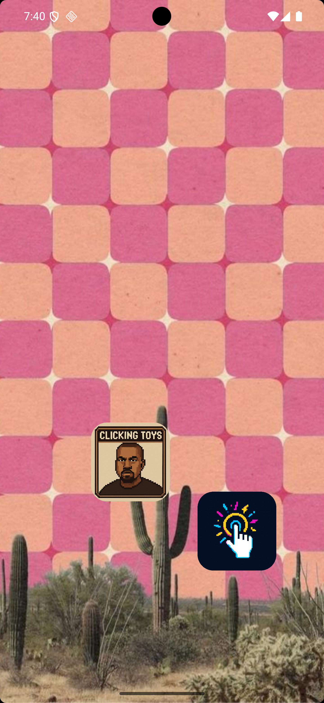
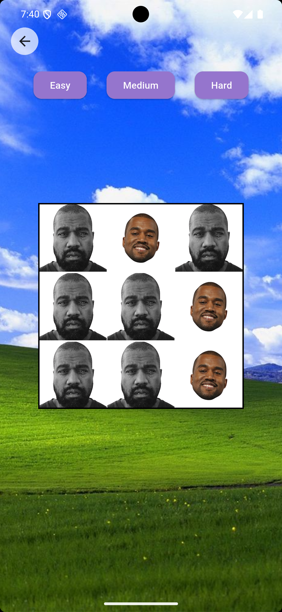
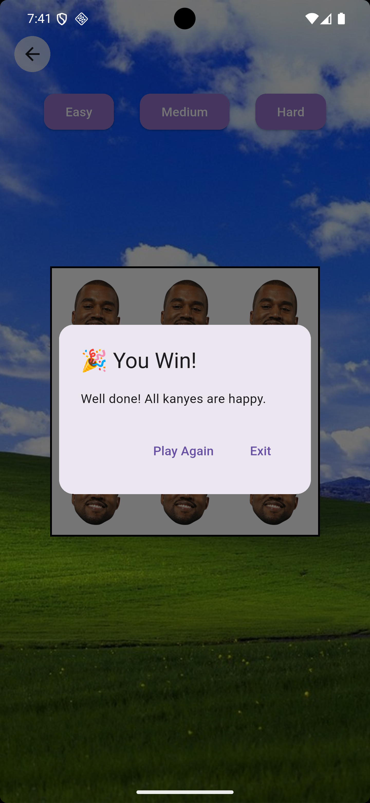
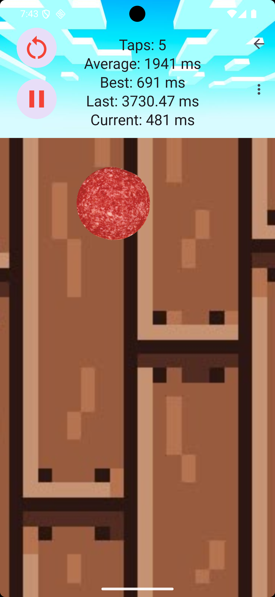
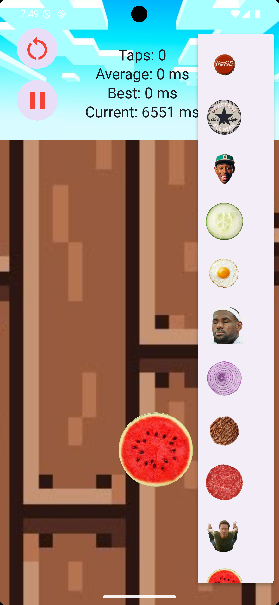

# big_g_mini_games

# 🎮 Big G Mini Games

A collection of fast, fun, and retro-style mini games built with Flutter. This app is designed to test your reflexes and challenge your brain in short, engaging sessions. Whether you're tapping quickly or solving light puzzles — it's all here!

---

## 🧠 Included Games

### 1. **Clicking Toys (Niners Game)**
Turn all squares orange by tapping the right combination — but you only have a limited number of moves. A retro grid puzzle challenge!

### 2. **Reaction Time Game**
Test your reflexes! Tap as fast as possible when the screen changes — great for speed training or just quick fun.

### 3. **Balls Tap Game**
Another reaction-based game where you tap balls as quickly as you can. Improve your response time and challenge your friends.

---

## 📸 Screenshots

### 🧸 Main Menu  

### 🟧 Clicking Toys (Niners Game)  

### 🧠 Niners Game Win  

### ⚡ Reaction Game  

### 🟢 Balls Reaction Game  

---

## 🚀 Features

- ⚡ Fast-tap mechanics with animated feedback and timer logic  
- 🟠 Puzzle logic with win detection  
- 🎨 Retro pixel-art-inspired design  
- 🔁 Random level generator (Clicking Toys)  
- 🧩 Modular and scalable Flutter code

---

## 🛠️ Tech Stack

- Flutter
- Provider (state management)
- Dart

---

